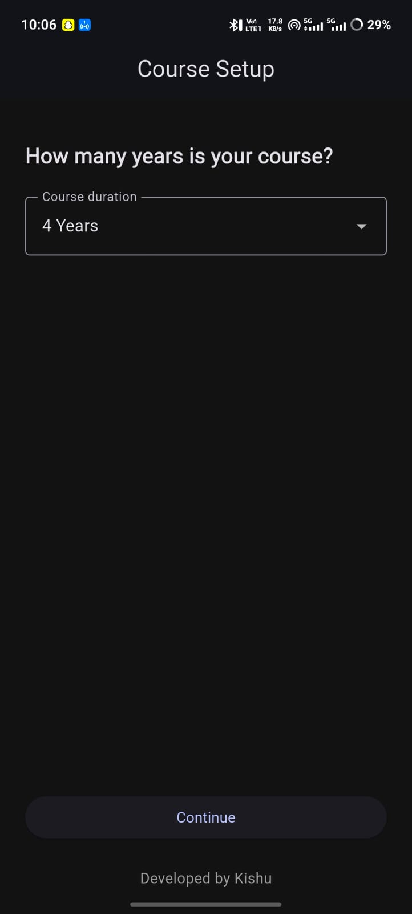
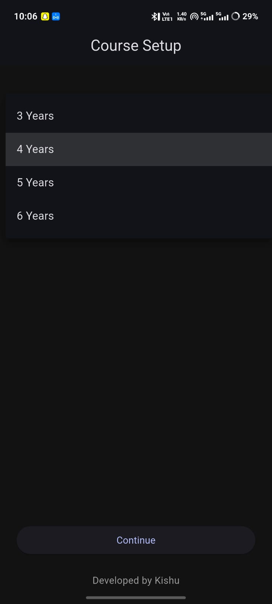
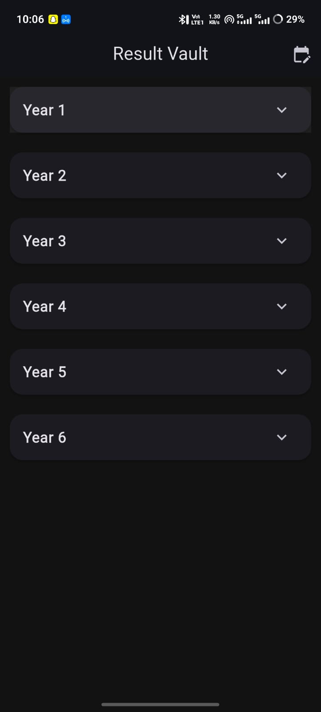
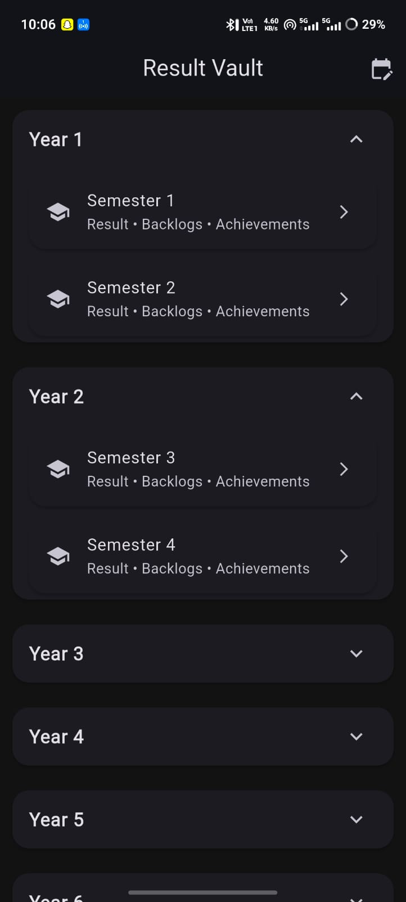
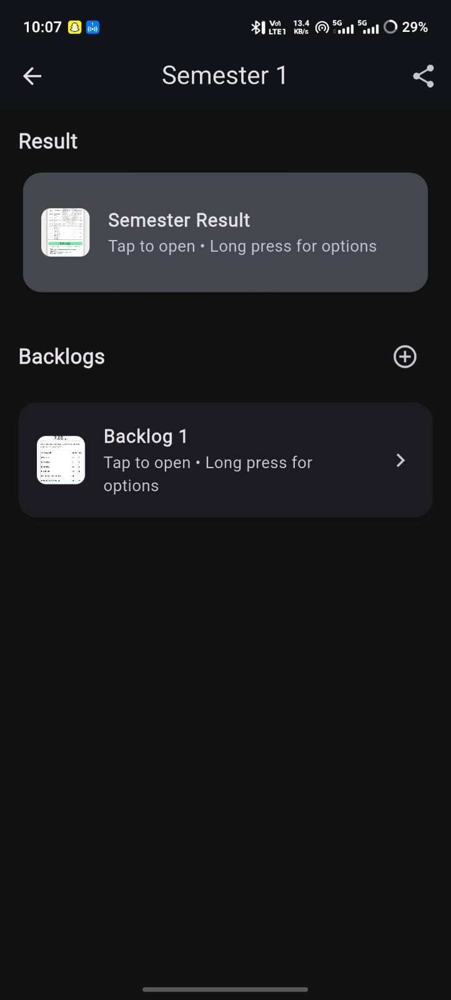

# 📚 Result Vault

### 📱 Offline Academic Record Manager Built with Flutter

Result Vault is a powerful offline-first academic document management application that allows students to organize semester-wise results, backlog records, and achievements with dynamic course duration configuration.

---

## 🚀 Key Features

- 🎓 Semester-wise result organization
- 📄 PDF & Image file support
- 🖼 Image thumbnail preview
- 🔄 Rename & delete functionality
- 📤 Multi-file sharing support
- 🔧 Dynamic course duration (3–6 years)
- 🌙 Adaptive Light & Dark mode
- 💾 Offline storage using SQLite
- 🔒 Non-destructive data structure (no data loss)

---

## 📸 App Screens

### 🏠 Home Screen / Course setup (after installation asks 1 time only)

### 📂 Semester Details

### 🌙 List of semester after selection

### 🧭 Years containing the 2 sem details 

###  Inside Each Semester tab 

---

## 🛠 Tech Stack

- **Flutter (Material 3)**
- **Dart**
- **SQLite (sqflite)**
- **SharedPreferences**
- **File Picker**
- **Path Provider**
- **Share Plus**
- **Native Android Splash & Launcher Icon**

---

## 🧠 Architecture Highlights

- Semester-indexed persistent storage
- Dynamic academic structure configuration
- Offline-first data design
- Modular UI architecture
- Scalable and maintainable code structure

---

## 📦 Installation

Download the latest APK from the **Releases** section.

1. Download APK
2. Enable “Install Unknown Apps”
3. Install the application

---

## 👨‍💻 Developed By

**Kishu**

---

## 📌 Version

v1.0.0
